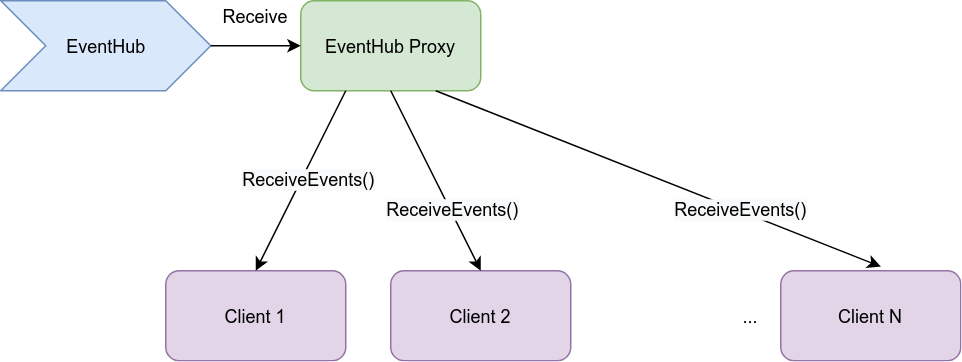

# Azure EventHub Stream Proxy
A gRPC service to proxy (broadcast) stream of events from Azure EventHub to multiple clients.

## How it works

A client calls `Subscribe()` on proxy.


Once there are events in the EventHub, the proxy server streams events by calling `ReceiveEvents()` on each client.



## Prerequisites

### Bazel
This project is built using bazel in version >= 3.7.0.
More information on Bazel: https://bazel.build/.
More information on Bazelisk: https://github.com/bazelbuild/bazelisk.

### Python
You need to use Python >= 3.8.

## Configuring
Configuration is done using flags.
Flags can be defined in `flag_files/server_flags`. To get detailed help on flags, run:
```
bazelisk run eventhub_stream_proxy:eventhub_stream_proxy -- --help
```
```
bazelisk run eventhub_stream_proxy:example_client -- --help
```

More information on flags: https://abseil.io/docs/python/guides/flags

## Running
### Server
```
bazelisk run eventhub_stream_proxy:eventhub_stream_proxy -- --flagfile=`pwd`/flag_files/server_flags
```

### Example client(s)
```
bazelisk run eventhub_stream_proxy:example_client -- --eventhub_stream_proxy_address=localhost:50002
```

### Integrating
Contract is defined in proto: `proto/event.proto`.
1. A client subscribes (`EventSubscription::Subscribe`) to a server to get the stream of events (`Event`).
1. A client implements `EventReceiver` to run each time new event is streamed.

More information on proto: https://developers.google.com/protocol-buffers/docs/proto3

### Example
Please refer to `eventhub_stream_proxy/example_client.py`, where there is an example client implementation in Python.
Since the service is written using gRPC, a client can be desinged using any framework supported by gRPC.
More information on gRPC: https://grpc.io/

## Running unit tests
```
bazelisk test ...:all
```
